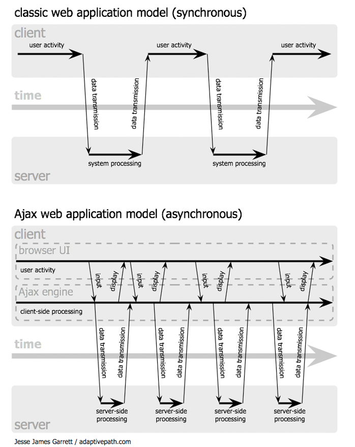

# **Ajax**

#### Getting and receiving information from other servers

---

# History of Ajax

"In the early-to-mid 1990s, most Web sites were based on complete HTML pages. Each user action required that a complete new page be loaded from the server. This process was inefficient, as reflected by the user experience: all page content disappeared, then the new page appeared. Each time the browser reloaded a page because of a partial change, all of the content had to be re-sent, even though only some of the information had changed."[^1]

[^1]: https://en.wikipedia.org/wiki/Ajax_(programming)#History

---

# History of Ajax

* Created by Microsoft for Outlook web application
* Added to other browsers soon afterward
* Popularized by Google with Gmail
* The term "Ajax" first used by Jesse James Garrett[^2]

[^2]: http://adaptivepath.org/ideas/ajax-new-approach-web-applications/

---



---

# Superagent

https://visionmedia.github.io/superagent/

Superagent is a library to create Ajax calls. There are other options like Axios, fetch, and request, but Superagent is the one we'll use.

---

```js
import request from 'superagent'

request
  .get('/search')
  .then(function(res) {
    console.log("results", res.body)
    // res.body, res.headers, res.status
  })
  .catch(function(err) {
    alert("There was an error! " + err.message)
    // err.message, err.response
  });
```

---

# What do we get back from the server?

Usually, JSON (JavaScript Object Notation) is used. Superagent can parse this into actual JavaScript objects.

---

https://www.googleapis.com/books/v1/volumes?q=doris+lessing

```js
{
 "kind": "books#volumes",
 "totalItems": 1876,
 "items": [
  {
   "selfLink": "https://www.googleapis.com/books/v1/volumes/sr_8066WKzMC",
   "volumeInfo": {
    "title": "The Golden Notebook",
    "subtitle": "A Novel",
    "authors": [
     "Doris Lessing"
    ],
    "publisher": "Harper Collins",
    "publishedDate": "2008-10-14",
    // ...
```

---

# HTTP requests

* Request method: GET, POST, PUT, DELETE, others
* URL
* Headers (Accept, Authorization, Content-Type, User-Agent, lots of others)
* Body (for POST and PUT requests)

---

# HTTP responses

* Status code (200, 201, 301, 400, 404, lots others)[^3]
* Headers (Content-Type, Content-Length, Location, lots of others)
* Body

[^3]: https://httpstatuses.com/
